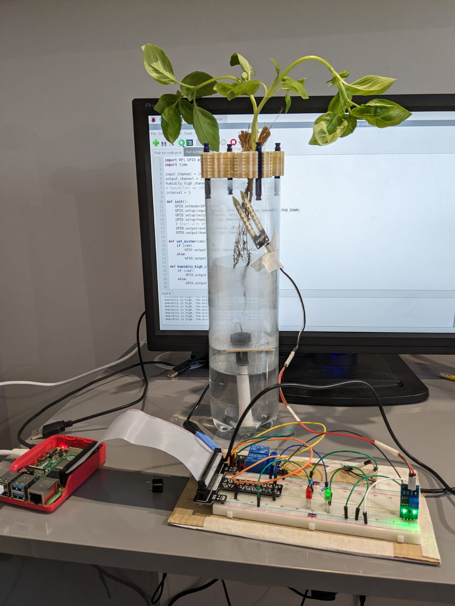

# Aerogrower
**A RaspberryPi based aeroponics Plant grower.**

## Introduction
 - Aeoroponics and Hydroponics is when plants are grown without a growth medium (soil) instead the roots of the plant are direct;y fed the nutrients and water it needs.
 The difference between hydroponics and aeroponics is that Hydroponics is when a plant's roots are suspended in water, on the other hand, Aeroponics is when they are suspended in air.

 - In an aeroponics system, the plant roots are suspended in a chamber of air, they are periodically fed a mixture of water and nutrients. Normally this is in the form of a sprayer or a tower in which water droplets pass through the roots. But in the Aerogrower, a mister is used instead, because of this plants can be placed anywhere as long as their roots are in the chamber as the mist reaches all parts of the chamber, unlike in most aeroponics setup.

 - In the Aerogrower, an ultrasonic piezo electric disk is used to form a mist of a nutrient and water solution for a plant, in this case basil.

 ## Benefits
### Aeroponics contains many benefits over conventional farming
- It can save up to **95%** more land!
- It can save up to **98%** more water!
- An aeroponics farm can be set up anywhere!
- Food can be grown closer to the consumer prolonging life.
- Can be small scale, you can have an aerogrower on your windowsill!
- Helps the environment!
 ## Required componets
    1. Raspberry Pi
    2. Breadboard (+ some jumper wires)
    3. Humidistat
    4. Piezo electric mister
    5. Relay
    6. LEDs

 ## Setup
The plant roots are kept in a chamber where they are constantly exposed to air, a humidistat determines the amount of humidity.
Under this chamber the water and nutrients solution is placed.
An Ultrasonic Piezo electric disk (mister) is placed on top of the solution tank. Therefore it sprays its mist into the roots chamber.

## How does it work

   A Raspberry Pi monitors the Humidity through the Humidistat. When it detects a low amount of humidity, it turns ON the Piezo electric mister giving the plant the moisture and the nutrients that it needs.

   When the humidity is back to required levels, it turns OFF the Pieze electric mister and thus stops providing the mist.

